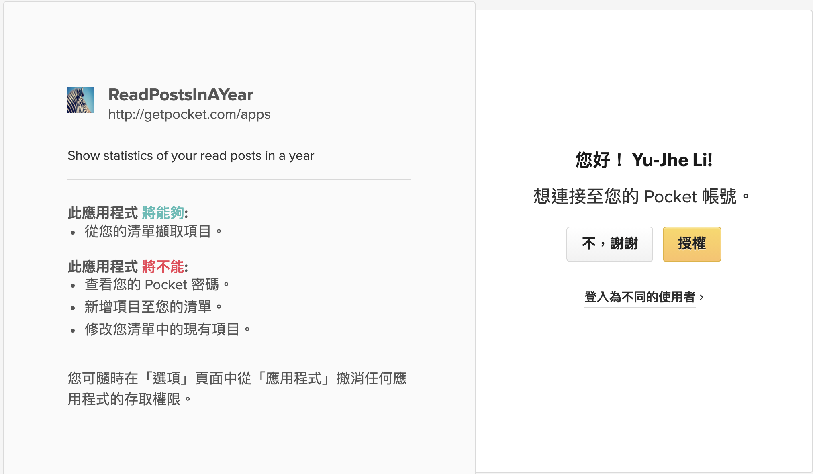

# read_posts_in_a_year
[Pocket](https://getpocket.com/) is a free service that makes it easy to discover great content that’s personalized to your interests, and save this content so you can return to it later.


This tool helps you to export your read (archived) posts in a year from [Pocket](https://getpocket.com/) to a Markdown file. You can use it to track your monthly reading status in that year.


## Requirements

* Python3
* pip


## Installation

- Use `pip` to install required packages

  ```sh
  $ pip install -r requirements.txt
  ```


## QuickStart

```sh
$ python read_posts_in_a_year.py --help
usage: read_posts_in_a_year.py [-h] [--init] [-y YEAR] [--export EXPORT]

show your read posts in a year from Pocket

optional arguments:
  -h, --help            show this help message and exit
  --init                initial for 1st time authorization
  -y YEAR, --year YEAR  the reading status of this year
  --export EXPORT       export your read statistics to file
```

* You need to login Pocket and authorize the app to access your reading list for the first time with `--init` argument **(skip `--init` if you have authorized before)**.

  ```sh
  $ python read_posts_in_a_year.py --init
  
  2019-01-26 11:30:46,892 - root - INFO - obtain request token from Pocket server
  2019-01-26 11:30:48,094 - root - INFO - authorize this app to access your Pocket list
  press <ENTER> after finish authorization in browser
  ...
  ```

  

* Export your reading statistics with detail in this year to a Markdown document.

  ```sh
  $ python read_posts_in_a_year.py
  
  2019-01-26 11:46:53,865 - root - INFO - obtain request token from Pocket server
  2019-01-26 11:46:55,170 - root - INFO - authorize this app to access your Pocket list
  2019-01-26 11:46:58,375 - root - INFO - obtain user access token from Pocket server
  2019-01-26 11:46:59,283 - root - INFO - retrieve archived posts from Pocket server
  # Read Posts in 2019
  # Read Posts in 2019
  | Month   | Read |
  | ------- | ---- |
  | 2019-01 |    3 |
  
  
  ## 2019-01
  * (POST)  2019/01/10 Tmux使用手册: http://louiszhai.github.io/2017/09/30/tmux/index.html
  * (POST)  2019/01/20 Getting your reading history out of Pocket using Python: https://medium.com/@alexdambra/getting-your-reading-history-out-of-pocket-using-python-b4253dbe865c
  * (POST)  2019/01/21 Authorization Code Authentication Flow in Python: http://luisquintanilla.herokuapp.com/2017/12/29/authorization-code-flow-python/index.html
  
  2019-01-26 11:47:00,250 - root - INFO - export your read statistics to file: 2019_read_posts.md
  ```

* Export your reading statistics in specific year to a Markdown document.

  ```sh
  $ python read_posts_in_a_year.py -y 2018
  
  2019-01-26 11:53:12,365 - root - INFO - obtain request token from Pocket server
  2019-01-26 11:53:13,650 - root - INFO - authorize this app to access your Pocket list
  2019-01-26 11:53:16,805 - root - INFO - obtain user access token from Pocket server
  2019-01-26 11:53:17,851 - root - INFO - retrieve archived posts from Pocket server

  # Read Posts in 2018
  | Month   | Read |
  | ------- | ---- |
  | 2018-10 |    5 |
  | 2018-11 |    9 |
  | 2018-12 |    1 |
  
  
  ## 2018-10
  * (POST)  2018/10/16 Apache Spark Scheduler: https://databricks.com/session/apache-spark-scheduler
  * (POST)  2018/10/16 Spark Scheduler模块详解-DAGScheduler实现: https://www.jianshu.com/p/ad9610bcb4d0
  * (POST)  2018/10/16 Spark Scheduler模块详解-TaskScheduler实现: https://www.jianshu.com/p/dc0c765732a1
  * (POST)  2018/10/16 Spark-Core源码精读(8)、TaskScheduler和SchedulerBackend: https://www.jianshu.com/p/09a7ab253682
  * (POST)  2018/10/16 [spark] TaskScheduler 任务提交与调度源码解析: https://www.jianshu.com/p/d3b620581dc2
  
  2019-01-26 11:53:19,136 - root - INFO - export your read statistics to file: 2018_read_posts.md
  ```

* Export to a specific file.

  ```sh
  $ python read_posts_in_a_year.py -y 2018 --export my_report.md
  ```


## Monthly Reading Report

* The tool default will output your reading report to `<yyyy>_read_posts.md`, like: [2018_read_posts.md](2018_read_posts.md)

  ```md
  # Read Posts in 2018
  | Month   | Read |
  | ------- | ---- |
  | 2018-10 |    5 |
  | 2018-11 |    9 |
  | 2018-12 |    1 |
  
  
  ## 2018-10
  * (POST)  2018/10/16 Apache Spark Scheduler: https://databricks.com/session/apache-spark-scheduler
  * (POST)  2018/10/16 Spark Scheduler模块详解-DAGScheduler实现: https://www.jianshu.com/p/ad9610bcb4d0
  * (POST)  2018/10/16 Spark Scheduler模块详解-TaskScheduler实现: https://www.jianshu.com/p/dc0c765732a1
  * (POST)  2018/10/16 Spark-Core源码精读(8)、TaskScheduler和SchedulerBackend: https://www.jianshu.com/p/09a7ab253682
  * (POST)  2018/10/16 [spark] TaskScheduler 任务提交与调度源码解析: https://www.jianshu.com/p/d3b620581dc2
  ```

## Developers

You can change [consumer_key](read_posts_in_a_year.py#L13) to your application, more detail in [authentication](https://getpocket.com/developer/docs/authentication).

